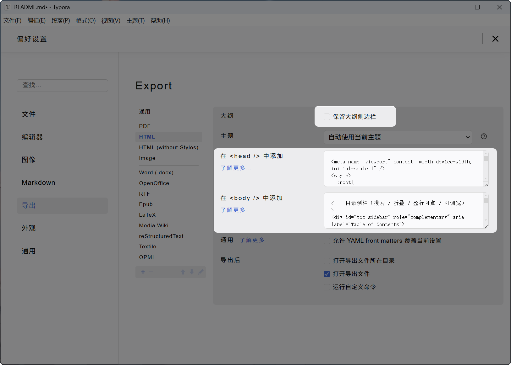
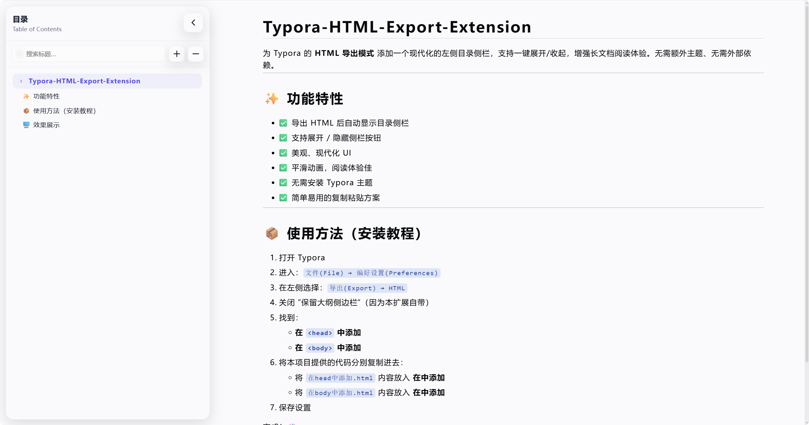

# Typora-HTML-Export-Extension
为 Typora 的 **HTML 导出模式** 添加一个现代化的左侧目录侧栏，支持一键展开/收起，增强长文档阅读体验。无需额外主题、无需外部依赖。

---

## ✨ 功能特性

- ✅ 导出 HTML 后自动显示目录侧栏
- ✅ 支持展开 / 隐藏侧栏按钮
- ✅ 美观、现代化 UI
- ✅ 平滑动画，阅读体验佳
- ✅ 无需安装 Typora 主题
- ✅ 简单易用的复制粘贴方案

---

## 📦 使用方法（安装教程）

1.  打开 Typora

2.  进入：`文件(File) → 偏好设置(Preferences)`

3. 在左侧选择：`导出(Export) → HTML`

4. 关闭 ”保留大纲侧边栏“（因为本扩展自带）

5. 找到：
    - **在 `<head>` 中添加**
    - **在 `<body>` 中添加**

6. 将本项目提供的代码分别复制进去：

    - 将 `在head中添加.html` 内容放入 **在<head>中添加**
    - 将 `在body中添加.html` 内容放入 **在<body>中添加**

7. 保存设置

完成！🎉

---

## 🖥️ 效果展示

